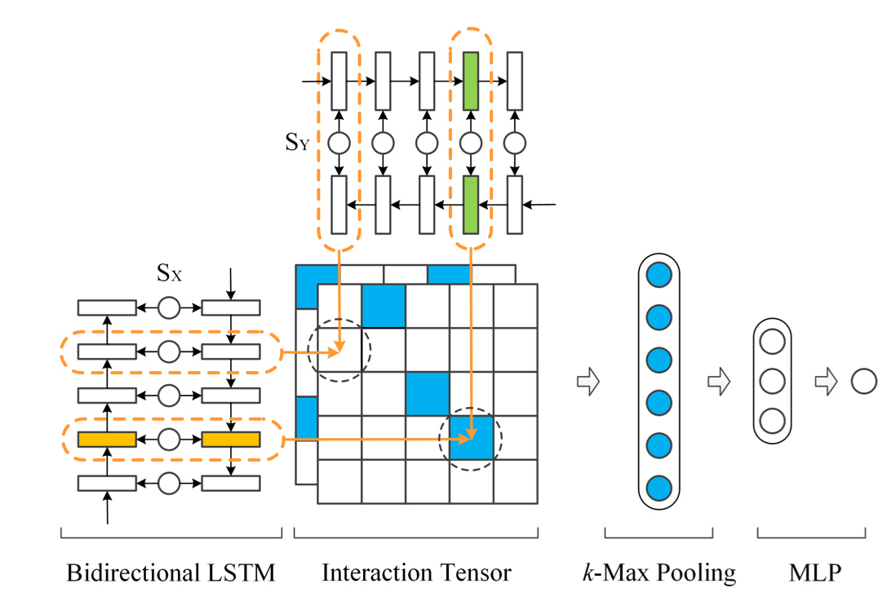

1、DSSM : Learning deep structured semantic models for web search using clickthrough data, PS Huang et al.

2、ARC：Convolutional Neural Network Architectures for Matching Natural Language Sentences, B Hu et al.

3、MV-LSTM : A Deep Architecture for Semantic Matching with Multiple Positional Sentence Representations, S Wan et al

4、MatchPyramid：Text Matching as Image Recognition, L pang et al.

5、BiMPM：Bilateral Multi-Perspective Matching for Natural Language Sentences, Z Wang et al.

6、DIIN：Natural Language Infefence Over Interaction space, Y Gong et al.

7、DRCN：Semantic Sentence Matching with Densely-connected Recurrent and Co-attentive Information, S Kim et al.

| Models       | NDCG@3 | NDCG@5 | MAP    |
| ------------ | ------ | ------ | ------ |
| DSSM         | 0.5439 | 0.6134 | 0.5647 |
| CDSSM        | 0.5489 | 0.6084 | 0.5593 |
| ARC-I        | 0.5680 | 0.6317 | 0.5870 |
| ARC-II       | 0.5647 | 0.6176 | 0.5845 |
| MV-LSTM      | 0.5818 | 0.6452 | 0.5988 |
| DRMM         | 0.6107 | 0.6621 | 0.6195 |
| K-NRM        | 0.6268 | 0.6693 | 0.6256 |
| aNMM         | 0.6160 | 0.6696 | 0.6297 |
| DUET         | 0.6065 | 0.6722 | 0.6301 |
| MatchPyramid | 0.6317 | 0.6913 | 0.6434 |
| DRMM_TKS     | 0.6458 | 0.6956 | 0.6586 |

### 2018-11-07 DSSM

$$\text{sim}_A(Q,D)=\frac{Q^T D}{\lVert Q\rVert \lVert D\rVert}$$

### 2018-11-08 L2R

在连接两个句子的Representation时，作者额外引入了一个值

$\text{sim}=u^TMv$

作者将上式类比为机器翻译中的噪声信道模型，并认为通过矩阵M的作用寻找最接近u的v(不太理解)

在实际测试中，发现没有sim这一项反而准确率上升。。(数据集有关？)

> The above equation can be viewed as a model of the noisy channel approach from machine translation,which has been widely used as a scoring model in information re-trieval and question answering [13]. In this model, we seek a trans-formation of the candidate document x0d = Mxd that is the closestto the input query xq. The similarity matrix M is a parameter of the network and isoptimized during the training.

### 2018-11-09 MV-LSTM

- Paper: A Deep Architecture for Semantic Matching with Multiple Positional Sentence Representations

- 思路：

  1. 首先，对于文本$S_X$和$S_Y$，分别采用**Bi-LSTM**对其在**各个位置(Position)**进行**表征(Representation)**

  2. 其次，将上述采集的表征进行**交互(Interaction)**，计算相似度得分的方式有**Cosine、Bilinear、Tensor Layer**

     > $\text{For Cosine} ~~~~ s(u,v)=\frac{u^Tv}{\lVert u\rVert \cdot\lVert v\rVert }$
     >
     > $\text{For Bilinear} ~~~~ s(u,v)=u^TMv + b$
     > $\text{For Tensor Layer} ~~~~ s(u,v)=f(u^TM^{[1:c]}v+W_{uv}\left[\begin{array}{ccc}
     > u\\
     > v\end{array} \right] + b)$

  3. 最后，对单个交互矩阵，采用 **$\textbf{k}​$-$\textbf{Max Pooling}​$** 池化操作返回前$k​$个值，再将所有这些值直接连接进行**MLP**

- 架构：

- 训练方式：**pairwise**，考虑三元组$(S_X,S_Y^+,S^{-\\}_{Y})$，定义损失函数为hinge loss
  $$
  L(S_X,S_Y^+,S^{-\\}_{Y})=\text{max}\{0,~~1-s(S_X,S_Y^+)+s(S_X,S^{-\\}_{Y})\}
  $$

- 几点思考：

  - MV-LSTM本质上还是**Representation-Based**的相似度匹配计算方式，但采用双向LSTM的网络结构充分考虑了文本的上下文信息。
  - 对得到的交互矩阵直接选择Pooling操作，没有多余的卷积步骤。个人觉得一方面是第一步Bi-LSTM获取的位置表征已经提取了足够的特征；另一方面， **$k$-$Max Pooling$** 的物理意义也很明确，体现了的**位置信息**对匹配结果的重要性。
  - 是否可以把listwise转化为pairwise的训练形式，通过多组pair体现出其排序的高低关系？效果如何？ 

**初入文本匹配的坑，总体上来看本文思路描述的较为清晰，值得学习。**